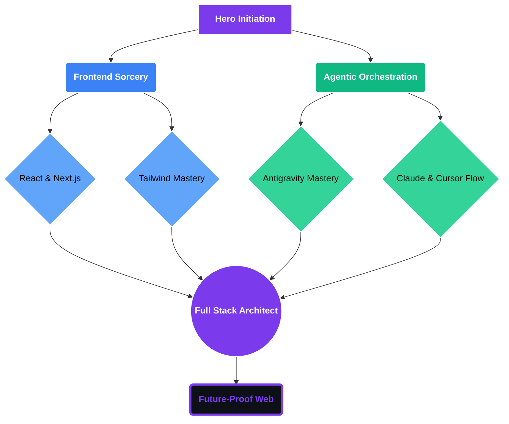

#  Hi, I'm Ashborn

  

---

### ⚔️ Character Profile: The Architect

| **Trait** | **Value** | **Rank** |
| :--- | :--- | :--- |
| **Role** | `Frontend Architect` | `Lead Orchestrator` |
| **Expertise** | `Vibe Coding` | `S-Tier Architect` |
| **Primary Stack** | `Next.js / TypeScript` | `Legendary Loadout` |
| **Secondary Stack** | `AI Agents / Python` | `Ancient Grimoire` |

---

### 🌲 Class Progression: Skill Tree

---

### 📜 The Grimoire: Hidden Archives

<b>🏗️ Ancient Architectural Philosophy</b>

 
I believe in <b>Elegant Scalability</b>. My approach involves modularized component design, strict type safety, and seamless integration of AI-driven tools to enhance productivity without sacrificing quality. I bridge the gap between complex backend logic and user-centric frontend experiences.

<b>🧪 Current Alchemical Experiments</b>

 

- **Multi-Agent Systems:** Researching how autonomous agents can collaborate on complex frontend refactors.
- **Cinematic UI:** Exploring advanced **Framer Motion** transitions and WebGL for immersive browsing experiences.
- **Vibe Coding:** Automating the "vibe" to "code" pipeline for faster prototyping.

<b>🧰 The Architect's Hidden Toolbox</b>

 
Beyond the core tech stack, I rely heavily on **Figma** for high-fidelity prototyping, **PostgreSQL** for robust data management, and **Vercel** for lightning-fast edge deployments. My workflow is optimized for speed, reliability, and aesthetic excellence.

---

### 🎒 Inventory & Gear

  

---

### 🐍 The Expedition: Contribution Flow

  <picture>
    <source media="(prefers-color-scheme: dark)" srcset="https://raw.githubusercontent.com/Ashborn-047/Ashborn-047/output/github-snake-dark.svg" />
    <source media="(prefers-color-scheme: light)" srcset="https://raw.githubusercontent.com/Ashborn-047/Ashborn-047/output/github-snake.svg" />
    
  </picture>

<i>Waiting for the first expedition run to complete...</i>

---

### 🕹️ Legendary Instance: Contribution Strike

  

  <i>Visualizing GitHub contributions as a high-octane Space Shooter 🚀</i>

---

### 📊 Vital Statistics

  

  

---

### 🤝 Hall of Fame & Inspiration

- 🐍 **Snake Expedition:** Inspired by [tobimey](https://github.com/tobimey)
- 📜 **Interactive Grimoire:** Inspired by [DenverCoder1](https://github.com/DenverCoder1)
- 🚀 **Space Shooter Instance:** Powered by [gh-space-shooter](https://github.com/czl9707/gh-space-shooter)

---

  

