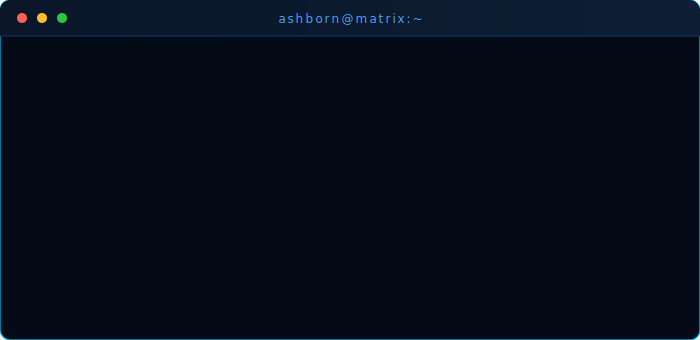
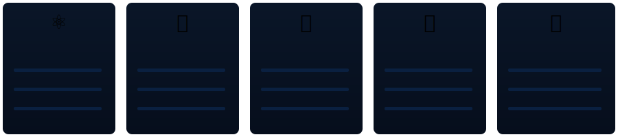

<div align="center">

<!-- HERO BANNER — upload hero-banner.svg to your repo root -->


</div>

---

<div align="center">

<!-- TERMINAL CARD — upload terminal-card.svg to your repo root -->


</div>

---

## 🌐 Skill Matrix

<div align="center">

<!-- SKILL CARDS — upload skill-cards.svg to your repo root -->


</div>

---

## 🏗️ Architecture Philosophy

```typescript
const philosophy = {
  principle_1 : "Modular First      — If it can't be reused, it can be rethought.",
  principle_2 : "Type-Safe Always   — Undefined behavior is a bug waiting to be filed.",
  principle_3 : "AI as Multiplier   — Eliminate tedious. Go deeper on what matters.",
  principle_4 : "Ship with Taste    — The gap between 'works' and 'delightful' is the job.",
} as const;
```

<details>
<summary><b>🧪 Currently in the Lab</b></summary>

<br>

| Experiment | Status | Description |
|:---|:---:|:---|
| Multi-Agent Refactor Systems | 🔬 Active | Autonomous agents collaborating on large-scale frontend migrations |
| Cinematic UI Engine | 🔬 Active | Framer Motion + WebGL for film-quality browser experiences |
| Vibe → Code Pipeline | ⚗️ Brewing | NLP-first UI prototyping — describe the vibe, receive the component |
| AI-Powered Design Tokens | 📋 Queued | Claude-driven design system adapting to user context dynamically |

</details>

<details>
<summary><b>🧰 The Hidden Toolbox</b></summary>

<br>

| Tool | Use Case |
|:---|:---|
| **Figma** | High-fidelity prototyping before a single line of code |
| **Cursor** | AI-native editor — pair programming at its finest |
| **PostgreSQL** | Robust, relational, relentlessly reliable |
| **Vercel** | Edge deployments so fast they feel like cheating |
| **Claude API** | The reasoning layer behind every intelligent feature |

> *The best tool is the one that disappears into the workflow.*

</details>

<details>
<summary><b>🌲 Full Skill Tree</b></summary>

<br>

```
                   ┌────────────────────────────────────┐
                   │        ⚡  HERO INITIATION          │
                   └───────────────┬────────────────────┘
                                   │
          ┌────────────────────────┼────────────────────────┐
          ▼                                                  ▼
┌──────────────────────┐                         ┌──────────────────────┐
│   🔮 FRONTEND FORGE  │                         │  🤖 AGENTIC MASTERY  │
└──────────┬───────────┘                         └──────────┬───────────┘
           │                                                │
     ┌─────┴─────┐                                   ┌─────┴─────┐
     ▼           ▼                                   ▼           ▼
┌─────────┐ ┌─────────┐                        ┌─────────┐ ┌─────────┐
│React &  │ │Tailwind │                        │ Claude  │ │ Cursor  │
│ Next.js │ │Mastery  │                        │ Agents  │ │  Flow   │
└─────────┘ └─────────┘                        └─────────┘ └─────────┘
     │           │                                   │           │
     └─────┬─────┘                                   └─────┬─────┘
           ▼                                               ▼
           └──────────────────┬────────────────────────────┘
                              ▼
                ┌─────────────────────────┐
                │   ⚡ FULL STACK LEGEND   │
                │      Rank: S-Tier        │
                └─────────────┬───────────┘
                              ▼
                ┌─────────────────────────┐
                │  🚀 FUTURE-PROOF WEB    │
                └─────────────────────────┘
```

</details>

---

## 📊 Vital Statistics

<div align="center">


<br/><br/>


</div>

---

## 🐍 Contribution Trail

<div align="center">
  <picture>
    <source media="(prefers-color-scheme: dark)"  srcset="https://raw.githubusercontent.com/Ashborn-047/Ashborn-047/output/github-snake-dark.svg"/>
    <source media="(prefers-color-scheme: light)" srcset="https://raw.githubusercontent.com/Ashborn-047/Ashborn-047/output/github-snake.svg"/>
    
  </picture>
</div>

---

## 🕹️ Contribution Strike

<div align="center">
  
  <br/>
  <sub><i>GitHub contributions — visualized as a high-octane space mission 🚀</i></sub>
</div>

---

## ⚡ Live Status

<div align="center">

<!-- STATUS BAR — upload status-bar.svg to your repo root -->


</div>

---

## 🤝 Credits

| Credit | Source |
|:---|:---|
| 🐍 Snake Expedition | [tobimey](https://github.com/tobimey) |
| 📜 Grimoire Format | [DenverCoder1](https://github.com/DenverCoder1) |
| 🚀 Space Shooter | [gh-space-shooter](https://github.com/czl9707/gh-space-shooter) |

---

<div align="center">


<br/><br/>

```
[ ARCHITECT STATUS: ONLINE ] [ AGENTS: DEPLOYED ] [ COFFEE: CRITICAL ]
```

*"The best code is the code that never needed to be written."*

</div>
