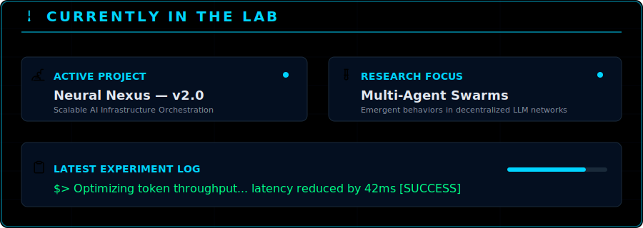
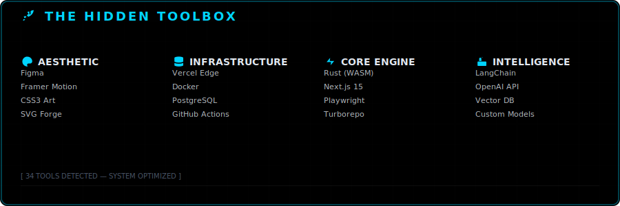
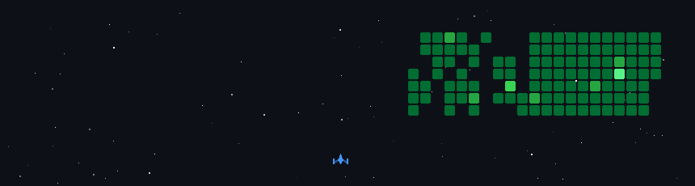

## 🌐 Skill Matrix

## 📊 Vital Statistics

  

## 🐍 Contribution Trail

  <picture>
    <source media="(prefers-color-scheme: dark)"  srcset="https://raw.githubusercontent.com/Ashborn-047/Ashborn-047/output/github-snake-dark.svg"/>
    <source media="(prefers-color-scheme: light)" srcset="https://raw.githubusercontent.com/Ashborn-047/Ashborn-047/output/github-snake.svg"/>
    
  </picture>

## 🕹️ Contribution Strike

  
   
  <i>GitHub contributions — visualized as a high-octane space mission 🚀</i>

## ⚡ Live Status

## 🤝 Credits

| Credit | Source |
+|:---|:---|
+| 🐍 Snake Expedition | [tobimey](https://github.com/tobimey) |
+| 📜 Grimoire Format | [DenverCoder1](https://github.com/DenverCoder1) |
+| 🚀 Space Shooter | [gh-space-shooter](https://github.com/czl9707/gh-space-shooter) |

 

  

*"The best code is the code that never needed to be written."*

